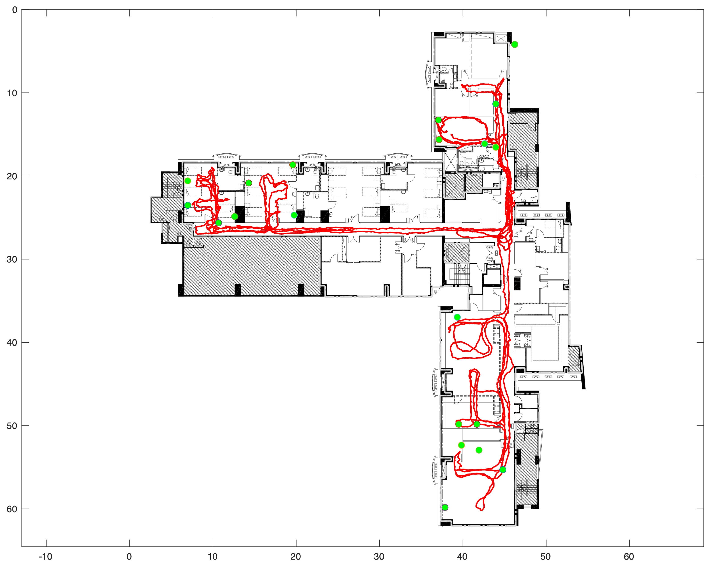
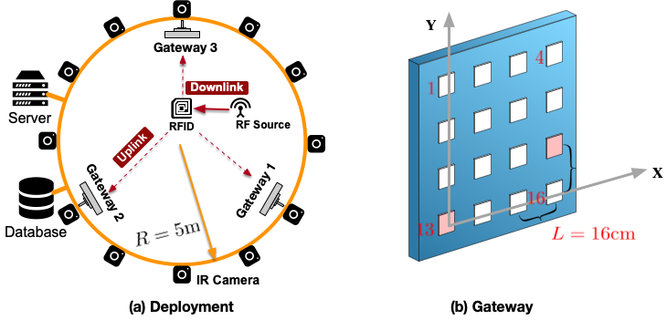

# Wireless-Localization-Dataset

## BLE Dataset

### Scenario

We provide the BLE localization dataset collected in the real-world experimental scenario. A total of 21 BLE gateways are deployed to collect the RSSI of BLE beacons. The RSSI is set to -100 dBm if the gateway does not detect any signal from the beacon.



### Data

 The dataset has a total of 6K records. [Download here](https://drive.google.com/drive/folders/1VbbmQx0inZOedKtWkQZGILoh7B9qDchi?usp=sharing).


|      File       |                       Description                       |
| :-------------: | :-----------------------------------------------------: |
|    rssi.csv     | The RSSI of the beacon measured by 21 gateways (g1-g21) |
| beacon_pos.csv  |           The ground truth location of beacon           |
| gateway_pos.csv |          The location of 21 gateways (g1-g21)           |
| floor_plan.pdf  |             The floor plan of the scenario.             |

## RFID Dataset

### Scenario

We provide the RFID localization dataset collected in the real-world experimental scenario. Three gateways are deployed to collect the RSSI and phase of the RFID tag. Each gateway is equipped with a 4 × 4 antenna array consisting of elements E1-E16.




### Data

The dataset has a total of 5K records. [Download here](https://drive.google.com/drive/folders/1Ek50DmQ4GF1pZeZloCsNpkzdPC4dfUJh?usp=sharing). The dataset is saved in JSON format as following:

```python
[
  {
    "gateway1":{
      "rssi":  [r1, r2, ..., r16]    # The RSSI value of E1-E16 on gateway 1
      "phase": [p1, p2, ..., p16]    # The phase value of E1-E16 on gateway 1
    }
    "gateway2":{
      "rssi":  [r1, r2, ..., r16]    # The RSSI value of E1-E16 on gateway 2
      "phase": [p1, p2, ..., p16]    # The phase value of E1-E16 on gateway 2    
    }
    "gateway3":{
      "rssi":  [r1, r2, ..., r16]    # The RSSI value of E1-E16 on gateway 3
      "phase": [p1, p2, ..., p16]    # The phase value of E1-E16 on gateway 3
    }
    "tag_pos": [x, y, z]   # The position of RFID tag
  }
  ...
]
```


